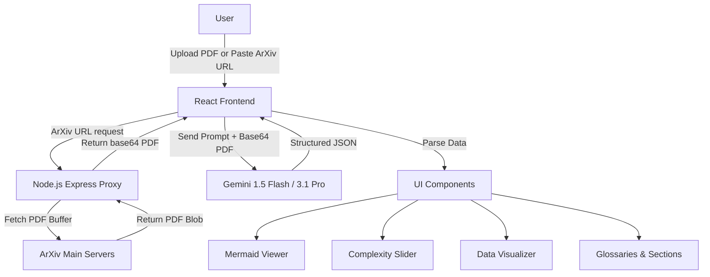

# SciArchitect 🔬

SciArchitect is a powerful, interactive visual dashboard that democratizes complex academic research using AI. By uploading a research manuscript or providing an ArXiv URL, it distills high-level scientific findings into different complexity levels (Layman, Undergraduate, Expert), visualizes the methodologies as flowcharts, and graphs quantitative data points for quicker, deeper understanding.

## Key Features

- **Multi-Level Synthesis:** Toggles down dense academic prose into three distinct complexity layers.
- **Architectural Flowcharts:** Automatically converts methodology sections into Mermaid.js diagrams.
- **Data Visualization:** Extracts key quantitative metrics and renders them as responsive charts via Recharts.
- **Glossary Extraction:** Identifies and defines the most complex terminologies in the paper.
- **ArXiv Proxy Server:** Fetches PDF files directly from an ArXiv URL via a built-in Express endpoint.
- **High-Density Design:** Clean, academic "dashboard" interface with a focus on readability and modern aesthetics using Tailwind CSS.

## Tech Stack

- **Frontend:** React 19, TypeScript, Vite
- **Styling:** Tailwind CSS (v4), Lucide Icons
- **Visuals:** Mermaid.js, Recharts
- **Backend (Proxy):** Node.js, Express
- **AI Integration:** `@google/genai` (Gemini 3.1 Pro Preview / 1.5 Flash)

## Architecture Diagram



## Code Snippet: Interactive Gemini Request

```typescript
// src/services/gemini.ts
import { GoogleGenAI, Type } from "@google/genai";
import { ResearchPaperAnalysis } from "../types";

const ai = new GoogleGenAI({ apiKey: process.env.GEMINI_API_KEY });

export async function analyzePaper(pdfBase64: string): Promise<ResearchPaperAnalysis> {
  const model = "gemini-3-flash-preview";

  const prompt = `
    Perform a rapid, high-precision analysis of this research paper. 
    1. Flowchart: Generate Mermaid.js code for the methodology.
    2. Metrics: Extract 3-5 key quantitative findings (label, value, unit).
    3. Content: Create 3 versions (Layman, Undergraduate, Expert) for Intro, Methods, and Results.
    4. Glossary: 5 complex terms defined.
    Return strictly JSON.
  `;

  const response = await ai.models.generateContent({
    model,
    contents: [
      {
        parts: [
          { text: prompt },
          { inlineData: { data: pdfBase64, mimeType: "application/pdf" } }
        ]
      }
    ],
    config: {
      responseMimeType: "application/json",
      // Enforced output format through Structured JSON schema
      responseSchema: { ... } 
    }
  });

  return JSON.parse(response.text!) as ResearchPaperAnalysis;
}
```

## Forking & Contributing

We welcome contributions to SciArchitect!

**To run the project locally:**
1. Clone this repository.
2. Install dependencies: `npm install`
3. Add a `.env` file referencing your Gemini key: `GEMINI_API_KEY="your-key-here"`
4. Run the full-stack server using: `npm run dev` (It launches an Express app that serves the Vite middleware).

**New Features to build/add:**
- **Text-to-Speech (TTS):** Integrate an audio reader to natively voice out the simplified content levels.
- **Reference Graph:** Visualize citations in a D3 force-directed node graph.
- **Chat with Paper:** Add a conversational UI panel using the Gemini Chat API to ask real-time questions about the document context.
- **Save & Share:** Add a database (e.g., Firebase) to cache and share specific dashboard configurations.
